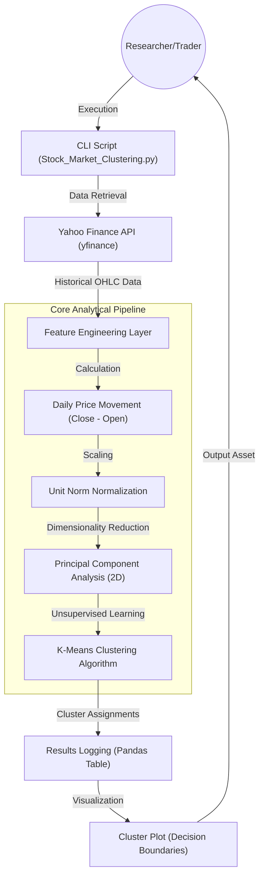

# Technical Specification: Optimizing Stock Trading Strategy with K-Means Clustering

## Architectural Overview

**Optimizing Stock Trading Strategy with K-Means Clustering** is an unsupervised machine learning pipeline designed to analyze and cluster financial market data. The system identifies latent patterns in stock movements by grouping equities based on historical volatility and returns, facilitating optimized portfolio diversification and market trend analysis.

### Processing Pipeline Diagram

---

## Technical Implementations

### 1. Machine Learning Engine: Scikit-Learn
The analytical core uses `scikit-learn` to implement a robust clustering pipeline.
-   **Clustering Algorithm**: Employs **K-Means Clustering** with 10 clusters and a maximum of 1000 iterations to categorize stocks.
-   **Dimensionality Reduction**: Utilizes **PCA (Principal Component Analysis)** with 2 components for visualizing high-dimensional movement data in a 2D plane and reducing feature noise.
-   **Data Normalization**: Applies a `Normalizer` to scale movement vectors to unit norm, ensuring stocks with different price levels are compared on a normalized basis.

### 2. Data Acquisition & Processing: yfinance & Pandas
-   **Real-time Data Fetching**: Uses the `yfinance` API to retrieve historical Open, High, Low, and Close (OHLC) prices for a defined universe of equities.
-   **Feature Engineering**: Mathematically extracts the daily movement (Delta = Close - Open) as the primary feature for clustering analysis.
-   **Data Sanitization**: Employs `Pandas` for handling multi-index DataFrames and `NumPy` for zero-fill imputation of missing values.

### 3. Visualization & Logging: Matplotlib & tqdm
-   **Graphical Representation**: Generates a high-resolution scatter plot using `Matplotlib`, featuring decision boundaries to visualize the separation between identified market clusters.
-   **Progress Monitoring**: Integrates `tqdm` progress bars to provide real-time updates during the data acquisition phase.
-   **Execution Logging**: Configures standard `logging` to monitor the pipeline's execution and data acquisition health in the terminal.

---

## Technical Prerequisites

-   **Runtime**: Python 3.8 or higher
-   **Data Libraries**: `yfinance`, `pandas`, `numpy`
-   **ML Stack**: `scikit-learn`
-   **Visualization**: `matplotlib`, `tqdm`

---

*Technical Specification | Computer Engineering Project | Version 1.0*
